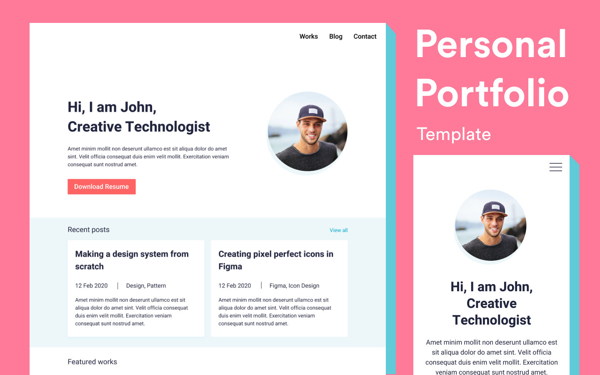

# Portfolio-UI

# Introduction

Welcome to Portfolio UI! This is a user-friendly web application that allows you to showcase your professional portfolio in a visually appealing way. With a clean and modern design, Portfolio UI provides an intuitive user interface that makes it easy for visitors to explore your portfolio and learn more about your skills, projects, and experience.

# How to Use

To get started with Portfolio UI, follow these steps:

1. Installation: Download the Portfolio UI template files or clone the GitHub repository to your local machine.

2. Configuration: Open the template files in a code editor and configure the settings, such as adding your personal information, updating the project details, and customizing the visual elements to match your branding.

3. Deployment: Once you have configured the template, you can deploy the portfolio website to a web server or a hosting platform of your choice. You can also use a static website hosting service, such as GitHub Pages or Netlify, to easily host your portfolio online.

4. Customization: You can further customize the portfolio website by modifying the CSS styles, updating the content, or adding new sections to showcase additional information about yourself or your work.

5. Maintenance: Keep your portfolio website up to date by regularly updating the projects, skills, and experience sections with your latest achievements and information. You can also periodically review the design and layout to ensure that it still meets your needs and reflects your personal brand.
